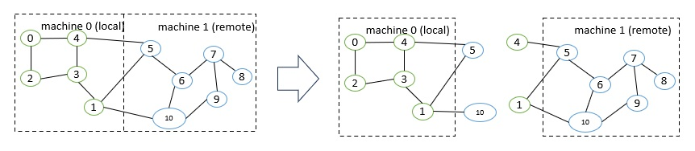

In collaboration with the engineering team at Intel, we are excited to announce distributed training solution for PyTorch Geometric is released in PyG 2.5 on the latest Intel Xeon platforms. Developers and researchers can take advantage of this distributed training for really big graph dataset which can not be fully loaded in one machine memory and at the same time it will reduce the training time greatly with the increasing of your node number used for training. In this blog, we perform a deep dive on how our distributed solution implemented and its performance for the scaling.

# Distributed Training for PyG

In real life applications graphs often consists of billions of nodes that can't be fitted into a single system memory. This is when the distributed training comes in handy. By allocating a number of partitions of the large graph into a cluster of CPUs one can deploy a synchronized model training on the whole database at once, by making use of [PyTorch Distributed Data Parallel (DDP)](https://pytorch.org/docs/stable/notes/ddp.html). The architecture seamlessly distributes graph neural network training across multiple nodes by integrating [Remote Procedure Call (RPC)](https://pytorch.org/docs/stable/rpc.html) for efficient sampling and retrieval of non-local features into standard DDP for model training. This is what our distributed training design for PyG.

## Key Advantages

- Balanced graph partitioning with METIS for large graph databases, using Partitoner
- Utilizing DDP for model training in conjunction with RPC for remote sampling and feature calls, with TCP and the 'gloo' backend specifically tailored for CPU-based sampling, enhances the efficiency and scalability of the training process.
- The implementation of a custom GraphStore/FeatureStore API provides a flexible and tailored interface for large graph structure information and feature storage.
- DistNeighborSampler capable of node neighborhood sampling in both local and remote partitions, through RPC communication channel with other samplers, maintaining a consistent data structure Data/HeteroData at the output
- The DistLoader/DistNeighborLoader/DistLinkLoader offers a high-level abstraction for managing sampler processes, ensuring simplicity and seamless integration with standard PyG Loaders. This facilitates easier development and harnesses the robustness of the torch dataloader
- Incorporating Python's asyncio library for asynchronous processing on top of torch RPC further enhances the system's responsiveness and overall performance. This solution follows originally from the GLT distributed library.
- Furthermore we provide homomgenous and heretogenous graph support with code examples, used in both edge and node-level prediction tasks.

## Architecture Components

1)	***Graph Partition***:  graph dataset partitioned into multiple parts over multiple  nodes that each node can load partition in memory.
2)	***Graphstore/Featurestore***: store the graph topology /id mapping between local and global ids/ partition mapping/ feature lookup api in LocalGraphStore/LocalFeatureStore which will be used distributed sampling. 
3)	***DistNeighborLoader***: trainging process will trig the distributed neighborloader process including distributed sampling process,  initial work process like create multiple torch rpc_workers for loader/samplers, regular node loader to finally formed all sampled nodes/features into PyG data formats
4)	***DistNeigbhorSampler***: sampling algorithm on top of partition unit which will include local/remote sampling and final merge between local/remote sampling results based on torch RPC mechanisms.
5)	***Torch RPC/DDP***: there are two distributed group for distributed training in PyG. Torch RPC is used for distributed sampling over multiple partitions including node sampling/feature loop and Torch DDP is used for the distributed training over multiple nodes. 

## Graph Partitioning
The first step for distributed training is to split the graph into multiple smaller partitions, which can then be loaded into nodes of the cluster. This is a pre-processing step that can be done once as the resulting dataset .pt files can be reused. The Partitoner build on top of ClusterData, uses pyg-lib implementation of METIS pyg_lib.partition algorithm to perform graph partitioning in an efficient way, even on very large graphs. By default METIS always tries to balance the number of nodes of each type in each partition and minimize the amount of edges between the partitions. This guarantees that the partition provides accessibility to all neighboring local vertices, enabling samplers to perform local computations without the need for inter-communication. Through this partitioning approach, every edge receives a distinct assignment, although certain vertices may be replicated. The vertices shared between partitions are so called "halo nodes" as in Figure 2 where nodes (1, 4, 5, 10) are all halo nodes to keep the graph information perfect even after partition.

    

Figure 2 – Graph Paritioning with Halo Nodes

In our distributed training example the script partition_graph.py demonstrates the partitioning for homogenous ogbn-products,``Reddit``, and heterogenous:ogbn-mag, Movielens datasets. The Partitioner can also process temporal attributes of the nodes which is presented in the Movielens dataset partitioning. 

The result of partitioning, for a two-part split of homogenous ogbn-products/ hetero ogbn-mag are shown in Figure 3:

    

Figure 3 – Two Partitions for Ogbn-Products/Ogbn-Mag dataset

In distributed training, each node in the cluster holds a partition of the graph. Before the training starts, we will need partition the graph dataset into multiple partitions, each of which corresponds to a specific training node. 

## LocalGraphStore/LocalFeatureStore
To maintain distributed data partitions we propose a modified remote interface of torch_geometric.data.GraphStore and torch_geometric.data.FeatureStore as shown in Figure 4 that together with integrated API for sending and receiving RPC requests provide a powerful tool for interconnected distributed data storage. Both stores can be filled with data in a number of ways, i.e. from torch_geometric.data.Data and torch_geometric.data.HeteroData objects or initialized directly from generated partition files. The distributed storage is a solution that can be used for both homogeneous and heterogeneous PyG graphs.

**LocalGraphStore**

torch_geometric.distributed.LocalGraphStore is a class designed to act as a container for graph topology information. It holds the edge indices that define relationships between nodes in a graph. Implemented on top of torch_geometric.data.GraphStore interface. It offers methods that provide mapping information for nodes and edges to individual partitions and support for both homogeneous and heterogeneous PyG graphs.

*Key Features*:

-	Local partition Edge Index storage: Stores information about local graph connections within partition.
-	Local and remote partitions connectivity: The affiliation information of individual nodes and edges to partitions (both local and global) can be retrieved through node and edge "partition books" - mappings of partition ID to node/edge ID.
-	Global identifiers: Maintains global identifiers for nodes and edges, allowing for consistent mapping across partitions.
-	Edge attribute storage: Stores unique edge identifiers of type torch_geomeric.data.EdgeAttr per each edge type.

**LocalFeatureStore**

torch_geometric.distributed.LocalFeatureStore is a class that serves as a node and edge feature storage. It holds node and edge attributes of the graph. Implemented on top of torch_geometric.data.FeatureStore interface it provides efficient put and get routines for attributes retrieval for both local and remote node/edge IDs. The local feature store is responsible for retrieving and updating features across different partitions and machines during the training process.

*Key Features*:

- Node and edge feature storage: It extends the torch_geometric.data.FeatureStore class and provides functionalities for storing, retrieving, and distributing node and edge features. Within the partition managed by each machine or device, node and edge features are stored locally.
- Remote feature lookup: Implements mechanisms for looking up features in both local and remote nodes during distributed training through RPC requests and evaluating PyTorch Futures. The class is designed to work seamlessly in distributed training scenarios, allowing for efficient feature handling across partitions.
- Global identifiers: Maintains global identifiers for nodes and edges, allowing for consistent mapping across partitions.

    

Figure 4 – Components/ APIs for LocalGraphStore/LocalFeatureStore

## DistNeigborLoader

As shown in Figure 5 for distributed Neighborloader architecture, distributed loader class torch_geometric.distributed.DistLoader is used to provide a simple API for the sampling engine described above. It wraps initialization and cleanup of sampler processes with the modified function torch_geometric.distributed.DistLoader.worker_init_fn. The distributed class is integrated with standard PyG torch_geometric.loader.NodeLoader through inheritance in top-level class torch_geometric.distribued.DistNeighborLoader and PyG torch_geometric.loader.LinkLoader through torch_geometric.loader.DistLinkNeighborLoader.

What makes batch generation slightly different from the single-node case is the step of local and remote feature fetching that follows node sampling. In a traditional workflow the output of iterator is passed directly to the loader, where torch_geometric.data.Data object is created using function torch_geometric.NodeLoader.filter_fn. Normally in this step node/edge attributes are assigned by performing lookup on input data object held in the loader. In distributed case, the output node indices need to pass through sampler's internal function torch_geometric.distributed.DistNeighborSampler._collate_fn that requests all partitions to return attribute values. Due to asynchronous processing of this step between all sampler sub-processes, the samplers may be forced to return output to class torch.multiprocessing.Queue, rather than directly to the output. 

    

Figure 5 – Breakdown Structure for DistNeighborLoader

## DistNeighborSampler

DistNeighborSampler is a module designed for efficient distributed training of Graph Neural Networks. It addresses the challenges of sampling neighbors in a distributed environment, where graph data is partitioned across multiple machines or devices. The sampler ensures that GNNs can effectively learn from large-scale graphs, maintaining scalability and performance.

**Asynchronous Neighbor Sampling and Feature Collection**:

Asynchronous neighbor sampling: Asynchronous sampling is implemented using asynchronous torch.distributed.RPC calls. It allows machines to independently sample neighbors without strict synchronization. Each machine autonomously selects neighbors from its local graph partition, without waiting for others to complete their sampling processes. This approach enhances parallelism, as machines can progress asynchronously leading to faster training. In addition to asynchronous sampling, Distributed Neighbor Sampler also provides asynchronous feature collection.

**Customizable Sampling Strategies**:

Users can customize neighbor sampling strategies based on their specific requirements. The module provides flexibility in defining sampling techniques, such as:
- Node sampling
- Edge sampling
- Disjoint sampling
- Node-based temporal sampling
- Edge-based temporal sampling
- Additionally, each of these methods is supported for both homogeneous and heterogeneous graph sampling.

**Distributed Neighbor Sampling Workflow Key Steps**:

Each batch of seed indices is passed to the torch_geometric.distributed.DistNeighborSampler and follows three main steps before its made available for the model's forward pass by the data loader:

***Distributed node sampling***: Utilizing the training seeds provided by the loader, the neighbor sampling procedure is executed. These training seeds may originate from either local or remote partitions. For nodes within a local partition, the sampling occurs on the local machine. Conversely, for nodes associated with a remote partition, the neighbor sampling is conducted on the machine responsible for storing the respective partition as shown in Figure 6.

***Distributed feature lookup***: Each partition stores an array of features of nodes and edges that are within that partition. Consequently, if the output of a sampler on a specific machine includes sampled nodes or edges, that do not pertain in its partition, the machine must initiate an RPC request to a remote server which these nodes (or edges) belong to.

***Convert to Data object***: Based on the sampler output torch_geometric.sampler.SamplerOutput and the acquired node (or edge) features, a torch_geometric.data.Data object is created (or its heterogenous counterpart). This object forms a batch used in subsequent computational operations of the model. This step occurs within the loader :func:`filter_fn`.

    

Figure 6 –  Distributed Sampler (local/ remote node sampling)

## Torch RPC /DDP

In this distributed training implementation two torch.distributed communication technologies are used:
- torch.distributed.ddp for data parallel model training
- torch.distributed.rpc for remote sampling calls & feature retrieval from distributed database
  
In our solution, we opted for torch.distributed.rpc over alternatives such as gRPC because PyTorch RPC inherently comprehends tensor-type data. Unlike some other RPC methods like gRPC, which require the serialization or digitization of JSON or other user data into tensor types, using this method helps avoid additional serialization/digitization overhead during loss backward for gradient communication.

The DDP group is initialzied in a standard way in the main training script. RPC group initialization is more complicated as it needs to happen in each sampler subprocess. This can be done by modifying function torch_geometric.distributed.DistLoader.worker_init_fn that is called at the initialization step of worker processes by a PyTorch base class torch.utils.data._MultiProcessingDataLoaderIter. This functions first sets a unique class torch_geomeric.distribued.DistContext for each worker and assigns it a group and rank, subsequently it initializes a standard class torch_geomeric.sampler.NeighborSampler that provides basic functionality also for distributed data processing, and finally registers a new member in an RPC group mp_sampling_worker as shown in Figure 7. This RPC connection remains open as long as the sub-process exists. Additonally, we opt for using atexit module to register additonal cleanup behaviors that are triggered when the process is terminated.

    

Figure 7 –  RPC group/ DDP group for distributed PyG

## Results and Performance

We did the benchmarking testing in below system configuration. 
- Bare-Metal
  - node, 2x Intel(R) Xeon(R) Platinum 8360Y CPU @ 2.40GHz, 36 cores, HT On, Turbo On, NUMA 2, Integrated Accelerators Available [used]: DLB 0 [0], DSA 0 [0], IAA 0 [0], QAT 0 [0], Total Memory 256GB (16x16GB DDR4 3200 MT/s [3200 MT/s]), BIOS SE5C620.86B.01.01.0003.2104260124, microcode 0xd000389, 2x Ethernet Controller X710 for 10GbE SFP+, 1x MT28908 Family [ConnectX-6], 1x 894.3G INTEL SSDSC2KG96, Rocky Linux 8.8 (Green Obsidian), 4.18.0-477.21.1.el8_8.x86_64
- Multi-nodes:
  - 2/4/8/16 nodes each with [same as bare metal as above]
- Software:
  - Python 3.9.16 / Pytorch 2.0.1/ Pytorch Geometric 2.4/ Pytorch PyG_lib 0.2.0/ Ogbn-Products dataset/ graph-sage Model
  
Figure 8 it shows the scaling performance of ogbn-products dataset under partition number (1/2/4/8/16) as processing time in batch unit for our distributed PyG training. This table shows the explicit scaling benefit when the partition number is increasing and this can reduce the training time greatly when graph dataset is really big. Figure 9 it shows the training loss & test accuracy over the epochs which can guarantee the correctness of our distributed solution for PyG. 

    

Figure 8 – Scaling Performance over Partition Numbers (1/2/4/8/16)

    

Figure 9 – Training Loss & Test Accuracy for Homo Ogbn-Products dataset

We also verfied the scaling performance for heterogeneous data, like ogbn-mag dataset. 

## Future Plans

The ongoing distributed work for PyG and next steps are:
- Extend the current distributed framework to Intel PVC GPU platform for PyTorch Geometric .
- Customer engagement /real customer user case based on current distributed training solution from PyG.

## Links

- [PyTorch Geometric](https://github.com/pyg-team/pytorch_geometric)
- [Readme for distributed training example for PyG](https://github.com/pyg-team/pytorch_geometric/tree/master/examples/distributed/pyg)
- [torch_geometric.distributed components](https://github.com/pyg-team/pytorch_geometric/tree/master/torch_geometric/distributed) 